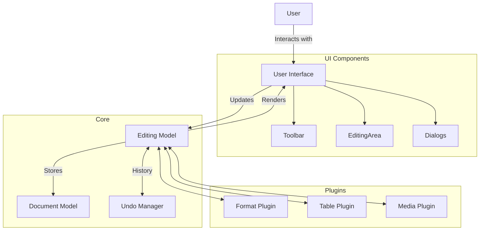

# CKE Editor Analysis

## System Overview

CKE Editor is a popular rich text editor for the web, enabling content creation with formatting, media embedding, and other advanced features. As one of the simpler systems in our analysis series, it provides a good starting point for understanding frontend architectures.

## Key Components

### User Interface Components
- Toolbar with formatting options
- Editing area
- Context menus
- Dialog boxes for media insertion, links, etc.

### Core Functionality
- Text formatting (bold, italic, etc.)
- Paragraph styling
- List management
- Media embedding
- Table creation and editing

### State Management
- Document model
- Selection state
- Undo/redo history
- Configuration state

## Architecture Diagram

## Data Flow

1. User interacts with the UI (clicks a button, types text)
2. Event handlers process the interaction
3. Commands are executed to modify the document model
4. The document model updates
5. UI re-renders to reflect changes
6. Changes are added to the undo history

## Performance Considerations

- Virtual DOM for efficient rendering
- Batched updates
- Lazy-loading of plugins
- Optimized event handling

## Implementation Plan

Our simplified implementation will include:

- Basic toolbar with common formatting options
- Rich text editing area
- Simple document model
- Undo/redo functionality
- Basic plugin architecture

### Technologies

- React + TypeScript for component structure
- Content-editable div with controlled behavior
- Custom hooks for selection and history management
- Tailwind CSS for styling

## Development Progress

- [ ] Basic editor layout
- [ ] Text formatting functionality
- [ ] Paragraph and list management
- [ ] Undo/redo history
- [ ] Basic plugin system

## Lessons Learned

*(To be completed after implementation)*

## Resources

- [CKEditor Official Documentation](https://ckeditor.com/docs/)
- [Rich Text Editing Best Practices](https://www.smashingmagazine.com/2021/05/building-wysiwyg-editor-javascript-slatejs/)